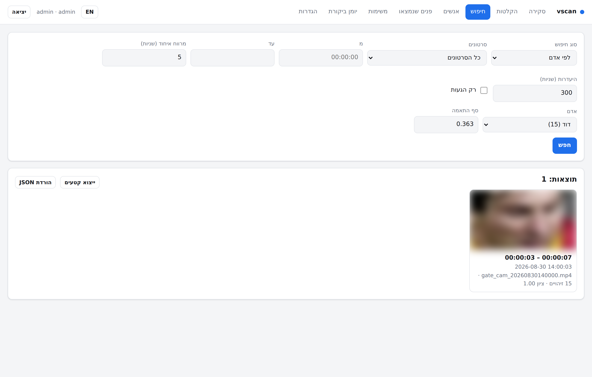

# vscan — search inside security-camera footage

Point it at recordings and ask *when* something happened:

```bash
vscan index recordings/ -r --objects
vscan enroll --name "David" photos/david*.jpg
vscan find  --person "David" --arrivals --report david.html
vscan ask   "someone carrying a large box to the front door" --report box.html
```

Four search engines share one index:

| | what it answers | where it runs |
|---|---|---|
| **Face search** | "when does *this person* appear", "when did they arrive" | fully local (OpenCV YuNet + SFace, CPU) |
| **Appearance search** | "who else looks like this" — works with no face visible | fully local (Youtu ReID, CPU) |
| **Object search** | "when was anyone/a car/a bag on camera" | fully local (YOLOX-S, 80 COCO classes) |
| **`ask` — instruction search** | anything you can describe in a sentence | frames are sent to the Claude API |

Everything except `ask` runs offline: no frame leaves the machine.

---

> A step-by-step install guide (macOS, Windows, Linux, Docker) lives in
> [docs/QUICKSTART.he.md](docs/QUICKSTART.he.md) — written in Hebrew.

## Two ways to run it

**As a CLI** on your own machine — the rest of this page.

**As an on-premise web application** for a team: one container, a browser UI in
Hebrew and English, accounts with viewer/analyst/admin roles, a job queue with
live progress, clip export, and an audit log of every search. That is the
product a company installs:

```bash
cd docker && cp .env.example .env && $EDITOR .env
docker compose up -d --build          # -> http://<host>:8080
```

Footage is mounted read-only, the models are baked into the image (no internet
needed at runtime), and natural-language search is off until an admin switches
it on. Full install, TLS, backup, retention and sizing guidance:
**[docs/DEPLOY.md](docs/DEPLOY.md)**.



*Faces are blurred in these screenshots on purpose - this is a face-recognition
product, and its documentation should not publish anybody's face.*

---

## Start here: is your footage searchable?

Before indexing anything, ask the footage itself:

```bash
vscan doctor /media/dvr/gate_cam.mp4
```

It samples the file, measures how often anything moves, how many pixels a face
actually gets and how tall people are in frame, then tells you plainly whether
face search will work on that camera, whether appearance search will, what
settings to use, and what indexing will cost in time and disk. Run it on a
prospect's camera before promising anything.

```
verdict
  [no ] faces are too small to identify
         faces top out around 18 px wide; 24 px is the floor and 40 px is where
         matching gets reliable.
  [ok ] appearance search will work
         median person height 143 px - enough for a re-id vector even when the
         face is not visible.

suggested command
  vscan index "gate_cam.mp4" --fps 2 --width 1280 --no-faces --objects --appearance
```

## Install

```bash
sudo apt install ffmpeg          # or: brew install ffmpeg
pip install -e .                 # core, offline pipeline
pip install anthropic            # only if you want `vscan ask`
vscan models fetch               # ~75 MB of ONNX models, once per machine
```

Python 3.10+. No GPU needed — everything is CPU ONNX through OpenCV's DNN module.

## The workflow

### 1. Index the footage

```bash
vscan index /media/dvr/2026-08-30/ -r --fps 2 --objects
```

Decoding is done by ffmpeg, so any container/codec a DVR produces works. Each
sampled frame goes through a **motion gate** first — on real CCTV most frames
are identical to the previous one, and skipping them is what makes hours of
footage practical. Frames that survive are stored with their faces (boxes +
128-d embeddings), optional object boxes, and a thumbnail, in
`./vscan-index/` (SQLite + JPEGs).

Wall-clock time comes from the file's `creation_time` tag, or from a DVR-style
filename (`ch01_20260830140000.mp4`), or from `--start-time "2026-08-30 14:00"`.
Results then carry real clock times, not just offsets.

### 1b. Faces are not enough — index appearance too

A face needs about 24 px of width. Cameras mounted high and wide rarely give
that, so index appearance vectors as well:

```bash
vscan index recordings/ -r --objects --appearance
```

Each person the detector finds is tracked across frames and described by a
768-dimension vector of their build and clothing, roughly once per second and a
half per person. That makes two more searches possible:

```bash
vscan similar --video gate --at 00:03:12          # who else looks like them?
vscan similar --video gate --at 00:03:12 --enroll "Courier"
vscan find --person "Courier" --by appearance     # every appearance, face or not
```

Appearance is deliberately weaker evidence than a face: clothes change between
days and two people in the same uniform look alike. It answers "find this
person in today's footage", not "identify this person".

### 2. Say who you are looking for

Three ways, all interchangeable:

```bash
# a) from photos
vscan enroll --name "David" david1.jpg david2.jpg

# b) from a moment in the footage itself ("that's him, right there")
vscan enroll --name "David" --from-video gate.mp4 --at 00:03:12 --at 00:07:40

# c) without knowing anyone: cluster every face in the index, then name one
vscan cluster --report faces.html
vscan label --cluster 0 --name "Courier"
```

`vscan cluster` answers "who shows up in this footage at all" — it groups the
indexed faces into one cluster per apparent person and writes a contact sheet
you can page through.

### 3. Search

```bash
vscan find --person "David"                        # every appearance
vscan find --person "David" --arrivals             # only arrivals (see below)
vscan find --person "David" --from 20:00 --to 23:00 --clips ./clips
vscan objects --labels person car --arrivals       # motion-free "someone was here"
vscan ask "a delivery van stopping at the gate"    # anything describable
```

Output looks like this, with an HTML timeline and JSON on request:

```
  1. gate_cam.mp4  00:12:03 - 00:12:24  (21.0s, 42 hits, best 00:12:11 @ 0.611)  [2026-08-30 14:12:03]
  2. gate_cam.mp4  01:47:50 - 01:48:02  (12.0s, 24 hits, best 01:47:55 @ 0.588)  [2026-08-30 15:47:50]
```

`--gap` decides when consecutive detections stop being one appearance (default
5 s). `--arrivals` collapses further: only the first appearance after
`--absence` seconds (default 5 min) of not being seen — that is the "when did
they get to the building" question.

`--clips DIR` cuts an mp4 per event with ffmpeg, `--report FILE` writes a
self-contained HTML page (thumbnails embedded, so it can be mailed as one
file), `--json FILE` writes machine-readable events.

## `ask` — the instruction search

```bash
export ANTHROPIC_API_KEY=sk-ant-...
vscan ask "someone leaving a bag near the entrance and walking away" \
      --from 18:00 --to 23:59 --max-frames 600 --report bag.html
```

Two passes:

1. **Triage** — indexed frames are tiled into numbered contact sheets (9 per
   request by default) and sent to Claude with your instruction; it returns the
   frames that match, each with a confidence.
2. **Confirmation** — every candidate is re-checked on its own
   full-resolution frame, decoded fresh from the video. This is what keeps
   grid-scale false positives out of the final list. `--no-confirm` skips it.

Cost is driven by frame count: `--max-frames` (default 400) evenly subsamples
whatever the filters selected, `--grid` sets frames per request, and
`--dry-run` prints the request plan without calling anything. Narrow with
`--video`, `--from/--to` and `--min-activity` before raising the frame budget.

The model is `claude-opus-5`; triage runs at `--effort low` (it is a simple
visual judgement) and confirmation at high effort. Server-side refusal
fallbacks are enabled when the SDK supports them, and a declined batch is
reported rather than silently dropped.

## Tuning

| Symptom | Knob |
|---|---|
| Misses a person the footage clearly shows | lower `--threshold` (0.363 → 0.30), enrol more reference faces, index at higher `--fps`, or search `--by appearance` instead |
| Matches the wrong person | raise `--threshold` (0.363 → 0.45), enrol sharper references, add `--min-sharpness 20` |
| Indexing too slow | lower `--fps`, drop `--objects`, lower `--width` |
| Motion gate skipping real events | lower `--motion` (0.004 → 0.001) or `--motion 0` to disable |
| Faces never detected | camera too far / too high; try `--width 1920`, and check `vscan videos` shows faces > 0 |

Rough throughput on 4 CPU cores, 1080p source, 2 fps sampling, motion gate off:
**~13× realtime** with face detection only, **~3× realtime** with `--objects`
as well. The motion gate typically removes most frames of real CCTV, so
practical speeds are far higher. One hour of footage at 2 fps costs roughly
50–150 MB of thumbnails; `--no-thumbs` removes that (at the cost of `ask` and
report images).

Face-match scores are cosine similarity between SFace embeddings; 0.363 is
OpenCV's published "same person" threshold and is the default. Appearance
scores are cosine similarity between Youtu ReID vectors, where 0.60 is the
default — that one is scene-dependent, so calibrate it with `vscan doctor` and
a known clip before trusting it.

Searches run as a single matrix product against a memory-mapped cache of all
vectors, rebuilt automatically when the index changes: 200,000 faces are
searched in about 55 ms rather than the 1.5 s a row-by-row scan takes.

## Commands

```
vscan index PATHS...      index video files or directories (-r to recurse)
vscan videos              what is in the index
vscan enroll --name N     add reference faces (images, or --from-video/--at)
vscan persons | forget    list / delete enrolled people
vscan find --person N     when a known person appears
vscan objects --labels    when objects appear (index with --objects first)
vscan cluster             group unknown faces: who appears at all
vscan label --cluster N   name a cluster, making it searchable
vscan similar             who else looks like the person at this moment
vscan doctor              is this footage searchable? measure before indexing
vscan ask "QUERY"         natural-language search (Claude API)
vscan clip                cut one clip out of an indexed video
vscan models list|fetch   manage the cached ONNX models
vscan-server              run the web application (see docs/DEPLOY.md)
```

`--index DIR` selects the index (default `./vscan-index`), `-v` turns on debug
logging. Every search command accepts `--video`, `--from/--to`, `--gap`,
`--min-hits`, `--arrivals`, `--json`, `--report`, `--clips`, `--limit`.

## Trying it without real footage

```bash
python tests/make_sample_video.py --faces alice.jpg bob.jpg --out demo.mp4
vscan index demo.mp4 --fps 3
vscan cluster --min-size 2          # two clusters, one per person
```

Tests: `pytest` (unit tests and the API tests always run; the end-to-end
face tests need `VSCAN_TEST_FACES=alice.jpg:bob.jpg`).

## Limitations

- Face recognition needs a face roughly 24 px wide or larger. People filmed
  from above, from behind or in the dark are found by appearance, object or
  instruction search instead — run `vscan doctor` to see which applies.
- Appearance search only matches within the same clothes, so it works within a
  day and not across weeks.
- Timestamps are accurate to about one sampling interval (0.5 s at 2 fps).
  Clips are cut from the original file, so they are exact.
- Clustering is greedy and single-pass: one person can end up as two clusters
  under very different lighting. Enrol from both, they merge into one identity.
- `ask` sees the frames you send it and nothing else; it cannot track across
  frames, and it is told not to guess identities.

## Before you use this

Face recognition on real people is regulated in most jurisdictions (GDPR
Art. 9 and national biometric laws in Europe, various state laws in the US).
Run it only on footage you are authorised to process, for a purpose you can
state, keep the index no longer than you need it (`vscan-index/` holds face
crops and biometric vectors — it is personal data), and tell the people who
are filmed, where the law requires it. The tool has no opinion about any of
this; you do.

MIT licensed. Models are from [OpenCV Zoo](https://github.com/opencv/opencv_zoo)
(Apache-2.0).
